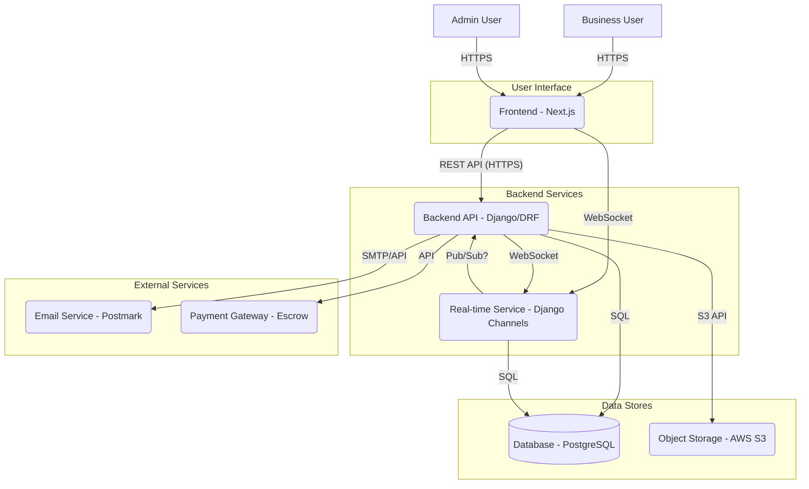

# NordicLoop Marketplace - System Architecture Design

## 1. Introduction

This document outlines the proposed system architecture for the NordicLoop Marketplace platform, based on the requirements specified in `Nordloop_word.docx`. The goal is to create a scalable, reliable, and secure platform for businesses to trade waste materials via an auction system.

## 2. Guiding Principles

*   **Component-Based:** Clear separation of concerns between frontend, backend, data storage, and supporting services.
*   **API-Driven:** Frontend interacts with the backend primarily through a well-defined RESTful API.
*   **Real-time:** Utilize WebSockets for features requiring real-time updates, such as bidding.
*   **Scalability:** Design components to scale independently based on load.
*   **Security:** Implement security best practices throughout the stack (Zero Trust principles, encryption).
*   **Cloud-Native:** Leverage cloud services for infrastructure, storage, and potentially other managed services.

## 3. High-Level Architecture (Conceptual)

The system consists of the following major components:

## 4. Component Breakdown & Technology Choices

| Component             | Technology             | Description                                                                                                | Key Responsibilities                                                                                                                               |
| :-------------------- | :--------------------- | :--------------------------------------------------------------------------------------------------------- | :------------------------------------------------------------------------------------------------------------------------------------------------- |
| **Frontend**          | Next.js                | Web application providing the user interface for businesses and admins.                                    | Rendering UI, handling user input, interacting with Backend API, establishing WebSocket connection for real-time updates.                            |
| **Backend API**       | Python Django (DRF)    | Core business logic, data management, and API layer.                                                       | User authentication/authorization, CRUD operations for users/ads/bids/transactions, business logic for auctions, integration with external services. |
| **Database**          | PostgreSQL             | Primary relational database for structured data.                                                           | Storing user profiles, ad details, bid information, transaction records, chat history, categories.                                                 |
| **Real-time Service** | Django Channels        | Handles WebSocket connections for real-time features.                                                      | Broadcasting bid updates, auction status changes, notifications, potentially chat messages.                                                        |
| **Object Storage**    | AWS S3                 | Scalable storage for binary files.                                                                         | Storing images uploaded for ads.                                                                                                                   |
| **Email Service**     | Postmark               | Transactional email delivery.                                                                              | Sending registration confirmations, password resets, auction notifications, transaction confirmations.                                             |
| **Payment Gateway**   | Escrow (or similar)    | Secure processing of payments for won auctions.                                                            | Handling payment flow, ensuring secure transactions between buyer and seller.                                                                      |
| **Admin Interface**   | Django Admin / Next.js | Interface for platform administrators (potentially integrated into the main Frontend or separate).         | Business approval, ad moderation, platform monitoring, user management.                                                                            |

## 5. Key Design Decisions

*   **RESTful API:** Django REST Framework (DRF) will expose a RESTful API for the Next.js frontend, enabling clear separation and potential for future clients (e.g., mobile app).
*   **WebSockets for Real-time:** Django Channels will manage WebSocket connections, pushing real-time bid updates and notifications to connected clients, ensuring low latency (<1s target).
*   **Unified User Role:** A single user model represents businesses, simplifying logic as users can both post ads and bid. Admin approval gates participation.
*   **Stateless API:** The Backend API should strive to be stateless, facilitating horizontal scaling. Session/auth state managed via tokens (e.g., JWT).
*   **Asynchronous Tasks:** Potentially use Celery (or Django Q) with Redis/RabbitMQ for background tasks like sending emails or processing complex post-auction logic, although Postmark might handle some notification aspects directly.

## 6. Data Model (Conceptual - See Requirements Doc Section 5.3)

*   **Users:** Company details, credentials, subscription status, approval status.
*   **Ads:** Details of waste material, auction parameters (duration, min bid), associated user, category, image references (S3 URLs).
*   **Bids:** Links ad and user, bid amount, timestamp.
*   **Transactions:** Links ad, winner, status (pending, paid, failed), payment details reference.
*   **Chats:** Links transaction, stores message history (potentially JSONB in PostgreSQL).
*   **Categories:** Predefined waste categories.

## 7. Scalability Considerations (Initial Thoughts)

*   **Stateless Services:** Design API and Real-time services to be stateless for horizontal scaling.
*   **Database Scaling:** Start with a single PostgreSQL instance; plan for read replicas or sharding if needed based on load. Monitor query performance.
*   **Caching:** Implement caching at appropriate levels (e.g., Redis for session data, API responses, potentially pre-calculated auction results). CDN for static frontend assets.
*   **Load Balancing:** Use load balancers in front of the Frontend, API, and Real-time services.

## 8. Security Considerations (Initial Thoughts - Zero Trust)

*   **HTTPS Everywhere:** All communication encrypted via TLS.
*   **Authentication:** Secure token-based authentication (e.g., JWT) for API access.
*   **Authorization:** Role-based access control (Admin vs. Business User). Fine-grained checks (e.g., user can only edit their own ads).
*   **Input Validation:** Rigorous validation of all API inputs.
*   **Dependency Scanning:** Regularly scan dependencies for vulnerabilities.
*   **Secrets Management:** Use a secure system (e.g., AWS Secrets Manager, HashiCorp Vault) for API keys, database credentials.
*   **Data Encryption:** Encrypt sensitive data at rest (database encryption) and in transit (HTTPS).

## 9. Reliability Considerations

*   **Uptime Target:** 95.9% (Requires robust deployment, monitoring, and failover).
*   **Backups:** Daily automated backups of the PostgreSQL database and potentially S3 data. Define RPO/RTO.
*   **Monitoring & Alerting:** Implement comprehensive monitoring (Prometheus/Grafana, Datadog, etc.) for application performance, infrastructure health, and errors. Set up alerts for critical issues.
*   **Health Checks:** Implement health check endpoints for services used by load balancers.

## 10. Deployment Strategy (Initial Thoughts)

*   **Infrastructure as Code (IaC):** Use Terraform or AWS CDK to define and manage cloud infrastructure.
*   **Containerization:** Package applications (Django, Next.js) into Docker containers.
*   **Orchestration:** Use Kubernetes (EKS) or a simpler PaaS (AWS App Runner, Render) for deployment and scaling.
*   **CI/CD:** Set up automated build, test, and deployment pipelines (e.g., GitHub Actions, GitLab CI).
*   **Environments:** Maintain separate environments (Development, Staging, Production).

## 11. Next Steps

*   Refine component interactions and API definitions (OpenAPI).
*   Detail database schema design.
*   Develop specific scaling and failover strategies.
*   Elaborate on security implementation details.
*   Create C4 model diagrams for deeper architectural views.