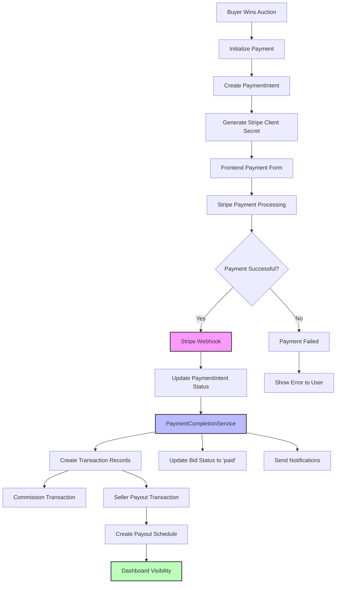

# **Complete Payment Flow Documentation**

## 📋 **Overview**

This document provides comprehensive step-by-step documentation of the Nordic Loop marketplace payment process from bid creation to transaction completion, including the current issues and their solutions.

**Date:** 2025-01-20  
**Status:** Analysis Complete - Issues Identified  

---

## 🔄 **Current Payment Flow Architecture**

### **1. Bid Creation & Auction Process**
```
1. Seller creates ad/auction
2. Buyers place bids
3. Auction ends → Winning bid determined
4. Bid status changes to 'won'
5. Buyer can initiate payment
```

### **2. Payment Initialization**
```
Frontend: WinningBidPayment.tsx → PaymentProcessor.tsx
Backend: BidPaymentProcessor.process_winning_bid()
```

**Flow:**
1. **Frontend Request:** `POST /api/payments/payment-intent/`
2. **Backend Processing:**
   - Validates winning bid
   - Calculates commission (7% default)
   - Creates PaymentIntent record
   - Calls StripeConnectService.create_payment_intent()
   - Returns client_secret for Stripe

### **3. Stripe Payment Processing**
```
Frontend: StripePaymentForm.tsx
Stripe: Payment confirmation
Backend: Webhook handling (if configured)
```

### **4. Payment Completion**
```
Current: PaymentCompletionService.complete_payment()
Expected: Creates Transaction records and updates statuses
```

---

## 🔍 **Current Database State Analysis**

### **Payment Intents:**
- ✅ **1 Payment Intent exists**
- **ID:** `52c8bc03-471b-473f-942a-f1c240a231e1`
- **Stripe ID:** `pi_3RyLKmGkYKANi90d1NfJqigA`
- **Status:** `requires_payment_method` (not completed)
- **Amount:** 11,000.00 SEK
- **Buyer:** olivierkarera2020@gmail.com
- **Seller:** karera@gmail.com

### **Transactions:**
- ❌ **0 Transaction records** (This is the main issue!)

### **Payout Schedules:**
- ❌ **0 Payout Schedules** (Expected after successful payments)

---

## 🚨 **Root Cause Analysis**

### **Issue 1: Payment Completion Not Triggered**
**Problem:** PaymentIntent status is `requires_payment_method`, not `succeeded`
**Cause:** Payment was initialized but never completed through Stripe
**Impact:** No Transaction records created, no dashboard visibility

### **Issue 2: Missing Webhook Configuration**
**Problem:** No automatic payment status updates from Stripe
**Cause:** Webhooks not properly configured or not handling payment completion
**Impact:** Manual payment completion not reflected in database

### **Issue 3: Transaction Creation Gap**
**Problem:** Transaction records only created on payment completion
**Cause:** PaymentCompletionService.complete_payment() never called
**Impact:** Empty transaction history in dashboards

### **Issue 4: Payout Schedule Generation**
**Problem:** No payout schedules created
**Cause:** Depends on successful payment completion
**Impact:** Sellers can't see payout information

---

## 📊 **Complete Payment Flow Diagram**



---

## 🔧 **API Endpoints Analysis**

### **Working Endpoints:**
- ✅ `POST /api/payments/payment-intent/` - Creates payment intent
- ✅ `GET /api/payments/transactions/` - Returns transaction history (empty)
- ✅ `GET /api/payments/payouts/` - Returns payout schedules (empty)
- ✅ `GET /api/payments/summary/` - Returns payment summary

### **Missing/Broken Functionality:**
- ❌ **Stripe Webhook Handler** - Not processing payment completion
- ❌ **Payment Completion Trigger** - Manual completion not working
- ❌ **Transaction Creation** - No records being created
- ❌ **Payout Schedule Generation** - No schedules being created

---

## 🎯 **Frontend Components Analysis**

### **Dashboard Components:**
1. **TransactionHistory.tsx** - ✅ Working but shows empty data
2. **PayoutSchedule.tsx** - ✅ Working but shows empty data
3. **PaymentProcessor.tsx** - ✅ Working for payment initialization
4. **WinningBidPayment.tsx** - ✅ Working for payment flow

### **Data Flow:**
```
Frontend → API Call → Backend Service → Database → Response → Frontend Display
```

**Current Issue:** Database has no Transaction/Payout records to display

---

## 🔄 **Expected vs Actual Flow**

### **Expected Flow:**
1. Payment Intent Created ✅
2. Stripe Payment Processed ❌ (Stopped here)
3. Webhook Updates Status ❌
4. PaymentCompletionService Called ❌
5. Transaction Records Created ❌
6. Payout Schedule Created ❌
7. Dashboard Shows Data ❌

### **Actual Flow:**
1. Payment Intent Created ✅
2. **FLOW STOPS HERE** ❌

---

## 🛠️ **Required Fixes**

### **1. Complete Test Payment**
- Simulate successful payment completion
- Update PaymentIntent status to 'succeeded'
- Trigger PaymentCompletionService manually

### **2. Configure Stripe Webhooks**
- Set up webhook endpoint handling
- Handle `payment_intent.succeeded` events
- Automatic status updates

### **3. Fix Transaction Creation**
- Ensure PaymentCompletionService creates Transaction records
- Verify commission and payout transaction creation
- Test transaction history API

### **4. Implement Payout Scheduling**
- Create PayoutSchedule records after successful payments
- Display payout information in seller dashboard
- Handle payout processing workflow

### **5. Test Dashboard Integration**
- Verify transaction history displays correctly
- Confirm payout schedules show in seller dashboard
- Test real-time updates

---

## 📝 **Next Steps**

1. **Simulate Payment Completion** - Create test data to verify dashboard functionality
2. **Fix Webhook Integration** - Ensure automatic payment status updates
3. **Test Transaction Visibility** - Verify all dashboard components work
4. **Implement Payout Tracking** - Complete seller payout workflow
5. **End-to-End Testing** - Full payment flow verification

---

## 🔗 **Key Files & Components**

### **Backend:**
- `payments/models.py` - PaymentIntent, Transaction, PayoutSchedule
- `payments/processors.py` - BidPaymentProcessor
- `payments/services.py` - StripeConnectService
- `payments/completion_services/payment_completion.py` - PaymentCompletionService
- `payments/views.py` - API endpoints
- `payments/webhooks.py` - Stripe webhook handling

### **Frontend:**
- `components/payments/PaymentProcessor.tsx` - Payment processing
- `components/payments/TransactionHistory.tsx` - Transaction display
- `components/payments/PayoutSchedule.tsx` - Payout tracking
- `app/dashboard/payments/page.tsx` - Payment dashboard
- `services/payments.ts` - API service calls

---

**🎯 CONCLUSION:** The payment system architecture is solid, but payment completion is not being triggered, resulting in empty dashboards. The fix requires completing the payment flow and ensuring proper webhook handling.
